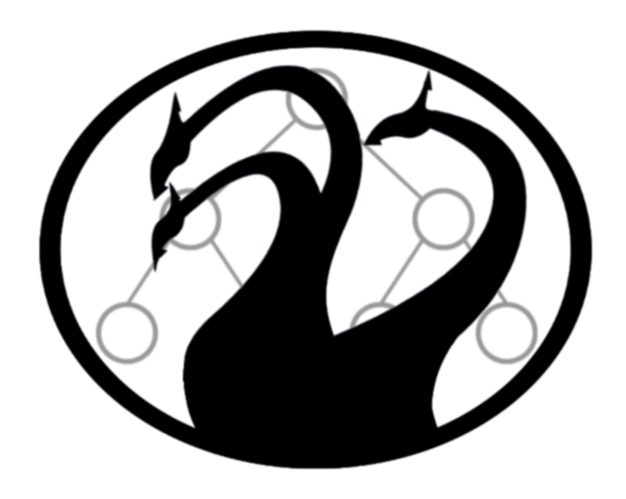

<p align="center">
  
</p>

# HydraSolver
An experimental constraint solver using the GPU to parallelize local search.

## Overview
```c++
hydra::Model model("Simple Demo");
auto var1 = model.createIntVar("var1", 5, 15);
auto var2 = model.createIntVar("var2", 9, 21);
auto var3 = model.createIntVar("var3", 3, 12);

model.postConstraint(hydra::CreateSumConstraint({ var1, var2, var3 }, 30));
model.postConstraint(hydra::CreateSumConstraint({ var2, var3 }, 19));

auto solver = hydra::Solver(&model);

auto solution = solver.findSolution();

if (solution.isConsistent()) {
	std::cout << solution.getFormattedSolution() << std::endl;
}
```
